# Lesson_constructor

    Существует множество методик в образовательной деятельности, построений моделей обучения. 
    Данный проект создан с целью автоматизировать разработку уроков в соответствии с Федеральным Государственным
    Образовательным Стандартом (ФГОС). Программа реализована в виде конструктора урока и позволяет не только выстроить урок из 
    эффективных образовательных методик, но также дает возможность формировать ключевые компетенции
    учащихся. Также учитель может добавлять новые методики обучения, совершенствуя базу методик программы.
    Урок разбивается на модули, каждый из которых имеет свою цель. Создаваемая программа способна из набора 
    методов сконструировать полноценный урок, разбить по сегментам и временным отрезкам, в зависимости от входных параметров.
    Цель данного проекта – помочь учителю построить урок наиболее оптимально и эффективно, с точки зрения 
    восприятия учениками учебного материала.
    Программа показала свою эффективность и востребованность среди учителей Тюменской области.
   
 Целью моей работы: создание программы, которая позволит учителю эффективно создавать шаблон урока по Федеральному Государственному Образовательному Стандарту, позволяющий использовать методики формирования различных компетентностей учащихся.
 
 Урок является основным элементом образовательного процесса. В соответствии с современными требованиями [1] урок должен не только обучать и воспитывать, но и формировать современные компетенции ученика. Формирование компетенций позволяет развить способности учащихся, что в свою очередь изменит их отношение к учебе и успеваемость. 
 
 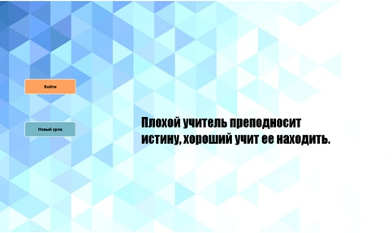
 ###### Рисунок 1. Окно меню у не авторизованного пользователя
 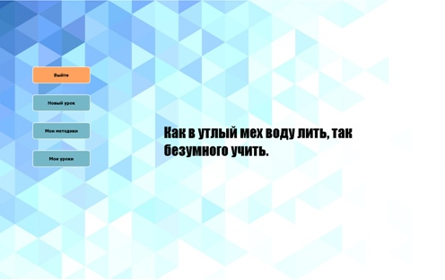​
 ###### Рисунок 2. Окно меню у авторизованного пользователя
 
 Сами компетенции развиваются на уроке с помощью различных приемов, которые называются «методики». Какие методики нужно применить, какой эффект они дают, определяется самим учителем [2].
 В своей программе я собрала методики, применяемые на уроке, используя пособие «Школьный конструктор опыта»[3]. Методики сформированы по элементам урока:  знакомства, разминка, изучение нового материала, закрепление пройденного материала, проверка понимания, бодрилки, рефлексия, объединение в команды и другие.
 Программа позволяет учителю из более 100 различных методик сформировать шаблон урока и напечатать его на листе бумаги. 
 
 Конструктор дает учителю доступ к сотне различных методик, и указанию, какие компетенции они развивают. Также можно сконструировать урок с целью формирования какой-либо компетенции, можно  - с ориентацией на групповую или индивидуальную работу с учениками.
 В программу можно вносить новые методики, таким образом продолжая совершенствовать базу методик.
 
 Программа была написана на языке Python и получила положительные отзывы среди учителей МАОУ СОШ № 88 города Тюмени и Тюменской области

## Составные части программы

Главное окно – меню содержит цитату урока и кнопку – “Новый урок”, кнопку “Войти”.
Если пользователь прошел авторизацию, то вместо кнопки “Войти” появляется кнопка “Выйти”. А также кнопки “Мои Методики” и “Мои Уроки”. (Рисунок 1, 2).       

 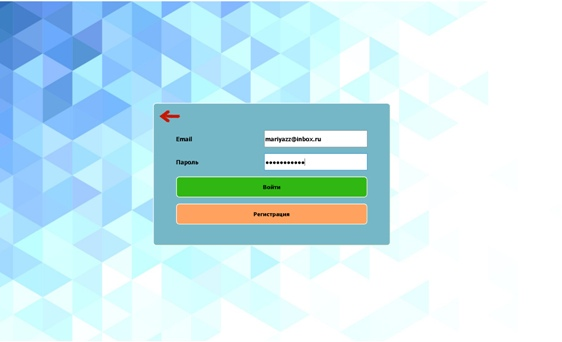
 ###### Рисунок 3. Окно авторизации
 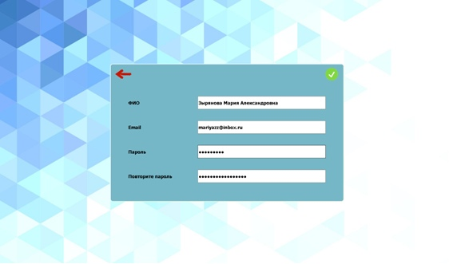​
 ###### Рисунок 4. Окно регистрации
 
Окно Авторизации содержит поля ввода email и пароль, если пользователь уже зарегистрирован
 в приложении, то он вводит значения в эти поля и наживает на кнопку “Войти”. 
 Программа проверяет данные, введенные пользователем, и выдает свой вердикт:
 Такого пользователя не существует, Неверный пароль, Вы не заполнили все поля.
 (Рисунок 3). Иначе предусмотрена регистрация, нажимаем на кнопку “Регистрация”.
 В окне регистрации есть поля для ввода ФИО, email, пароль, повторите пароль. 
 Аналогично авторизации при нажатии на “V” программа проверяет значения в полях
 ввода. (Рисунок 4).  

 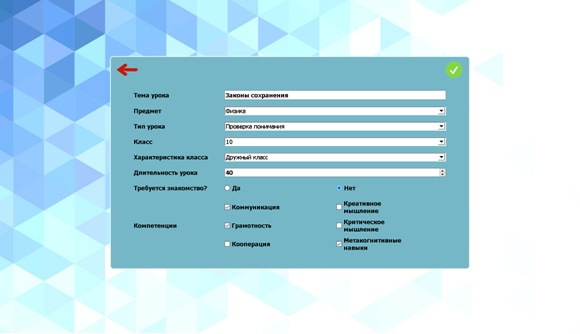​
 ###### Рисунок 5. Окно параметров урока
 
Окно параметров урока содержит объекты, которые необходимо заполнить (Рисунок 5).
От них зависит содержание этапов урока и карты, предлагаемы в зависимости от настроек
урока.
 
 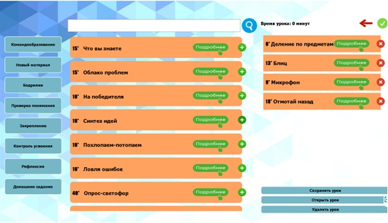​
 ###### Рисунок 6. Открывается окно выбора методик урока
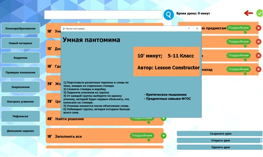​
###### Рисунок 7. Отображение содержания карт-методик
  
При нажатии на кнопку “ОК” из базы данных изымаются все карты соответствующие
введенным ранее данным. Открывается окно выбора методик урока (Рисунок 6).
Сверху поисковая строка по методикам, выбранного этапа урока.
Справа можно выбрать этапы урока, в соответствии с каждым из них, карты предлагаются 
пользователю. Это позволяет быстро найти интересные методики и гораздо точнее
формировать урок. 
Слева у нас находится панель урока. На ней отображаются все карты, выбранные учителем,
и краткая памятка сверху, чтобы можно было проверить введенные ранее данные.  
Время урока расположено сверху. Оно будет меняться в зависимости от уже “потраченного 
времени” урока.
(Каждая карта содержит лимит времени, предполагается, что учитель реализует методику
в течении этого времени. При добавлении карт в свой урок, оставшееся время урока будет
обновляться на новое)

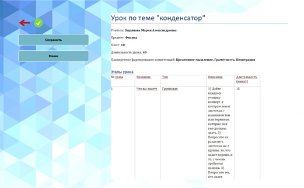​
###### Рисунок 8. форма отображения краткого конспекта урока

Учитель может выбрать несколько карт, даже если сумма времени карт ровна 40 минут 
(на дополнительные карты выделено 20 минут). Чтобы все карты поместились во временной 
диапазон урока, у каждой карты устанавливается новое время (пропорционально уменьшается
относительно времени других карт).
Когда вы закончите с конструированием урока и нажмете зеленую кнопку “V”, она
расположена над картами, то все выбранные вами карты отобразятся в Документе с
расширением doc. Ее Вы можете сохранить к себе на компьютер в формате doc/docx. 
Если пользователь авторизован, то документ также сохраняется в базу данных и в дальнейшем может повторно сохраняться. (Рисунок 8)

 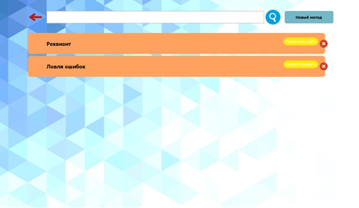​
###### Рисунок 9. форма Окно Мои методики

Также из главного меню можно при нажатии на кнопку “Мои методики” попасть в новое окно.
 В нем мы можем видеть поисковую строку, кнопку “назад”, кнопку создания новой 
 методики и скролл с уже созданными мной методиками. (Рисунок 9)
 
 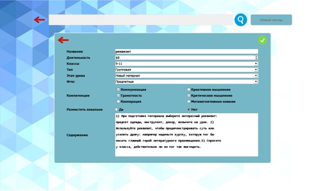​
###### Рисунок 10. форма Диалоговое окно Новый метод
 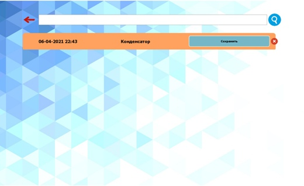​
###### Рисунок 11. Окно Мои Уроки

Кнопка “Новый метод” открывает диалоговое окно с полями ввода значений. (Рисунок 10)
Карта методики содержит название, кнопку “Редактировать” и кнопку “X”. Последняя кнопка удаляет методику из базы данных. А кнопка редактирования открывает диалоговое окно “Новый метод”,
 но вводит в поля автоматически все значения из этого метода. (Рисунок 11) 
 
#### Содержание карт-методик
На главной странице карты расположено название и время.
 С помощью кнопки “+” можно добавить карту в свой урок. Аналогично,
  если карта уже у вас в уроке, то вы можете ее удалить. С помощью кнопки 
  “Подробнее” открывается модальное окно, в котором отображается краткое 
  описание методики и компетенции,  которые она в себя включает, автора методики, 
  время  (Рисунок 7).

#### Запуск
    Запустите файл app_window/main.py

#### Список литературы
1.	Сергеенкова, К. В. Урок по ФГОС как новая форма организации образовательного процесса / К. В. Сергеенкова. — Текст : непосредственный // Теория и практика образования в современном мире : материалы VII Междунар. науч. конф. (г. Санкт-Петербург, июль 2015 г.). — Санкт-Петербург: Свое издательство, 2015. — С. 224-225. — / [Электронный ресурс]. – Режим доступа: https://moluch.ru/conf/ped/archive/152/8406/.
2.	Попова, С.М. Формирование ключевых компетенций обучающихся в соответствии с требованиями ФГОС на уроках истории и обществознания.// Международный педагогический портал (лицензия на осуществление образовательной деятельности №9757-л, свидетельство о регистрации СМИ №ЭЛ ФС 77-65391) / [Электронный ресурс]. – Режим доступа: https://solncesvet.ru/opublikovannyie-materialyi/formirovanie-klyuchevyh-kompetenciy-o/
3.	ООО ИКРА. Школьный конструктор опыта. / [Электронный ресурс]. – Режим доступа:  https://shko.ikraikra.ru
